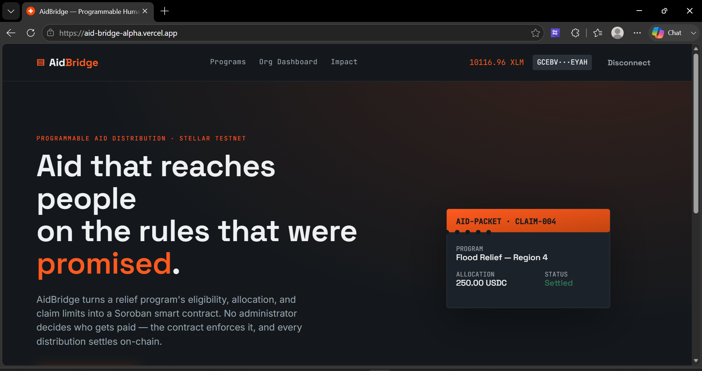
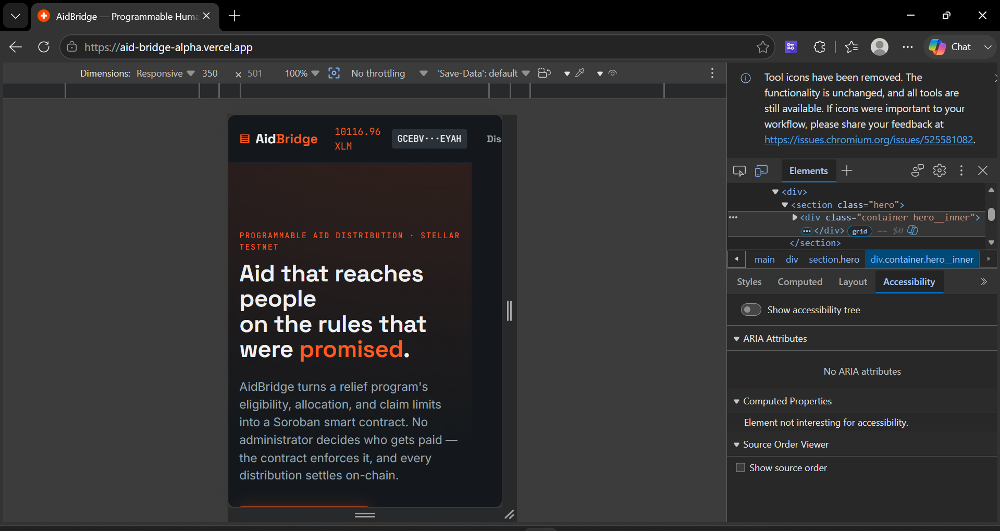
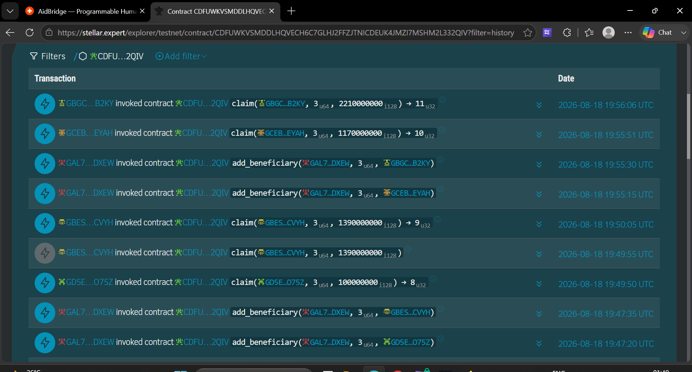

# 🚀 AidBridge — Programmable humanitarian aid distribution on Stellar Soroban

AidBridge is a production-ready humanitarian aid distribution platform built on Stellar (Soroban). It lets organizations define an aid program's eligibility, per-person allocation, claim window, and claim limits as a smart contract—then fund it and let beneficiaries claim directly from their own Stellar wallets without intermediaries.

## 🔗 Live Demo & Links
- **Live Platform**: [https://aid-bridge-alpha.vercel.app/](https://aid-bridge-alpha.vercel.app/)
- **Demo Video**: `<insert-demo-video-url>`
- **Example Transaction Hash**: [`0ff1bb77f83c013494cacf63bd36d45c3dd599116ee8a6c42d6194d33c2ee0dc`](https://stellar.expert/explorer/testnet/tx/0ff1bb77f83c013494cacf63bd36d45c3dd599116ee8a6c42d6194d33c2ee0dc)
- **AidBridge Contract ID**: `CDFUWKVSMDDLHQVECH6C7GLHJ2FFZJTNICDEUK4JMZI7MSHM2L332QIV`
- **Google Form Link**: [Feedback Form](<insert-form-url>)
- **Response Sheet**: [Response Sheet Link](https://docs.google.com/spreadsheets/d/1R8P-mTQuQtmrKeNWBk_KYxu3ry68FnXGZxQA987kt4M/edit?usp=sharing)

## 🌟 Key Features

1. **On-Chain Rules & Escrow**: Allocation caps, claim windows, and per-beneficiary claim limits are enforced by Soroban at the moment of claim, not by an administrator.
2. **Privacy Preserving**: Sensitive data (names, IDs) stays off-chain in the organization's backend. The blockchain only ever sees a wallet address and an eligibility flag.
3. **Non-Custodial Claims**: Beneficiaries hold the funds themselves. A claim is a transaction the beneficiary signs with their own wallet (via Freighter)—the platform never custodies aid funds on their behalf.
4. **Monitoring & Analytics**: Built-in tracking of unique wallets, total interactions, claims submitted, and aggregated user feedback to measure program impact.
5. **Robust Dashboard UI**: Built with React and Vite. Features a dedicated organization dashboard for program management and beneficiary review, plus a seamless public claim flow.

---

## 📝 Requirements Met

- **Advanced smart contract development**: Built with Rust, encompassing multi-state program lifecycle management (Active, Paused, Closed), authorization, and strict rule enforcement.
- **Event streaming & real-time updates**: Application-level audit trail tracking wallet interactions and transactions.
- **CI/CD pipeline setup**: GitHub Actions (`ci.yml`) automatically runs contract tests and builds the frontend/backend.
- **Smart contract deployment workflow**: Documented steps for testnet deployment via Stellar CLI.
- **Mobile responsive frontend development**: Fully responsive claim interfaces and dashboards across devices.
- **Error handling & loading states**: Integrated observability with Sentry, loading indicators, and comprehensive error catching for contract rejections.
- **Writing tests for contracts and frontend**: Extensive Rust unit tests (`src/test.rs`) covering the full happy path and every rejection scenario (duplicate claims, allocation overrun, outside window, etc.).
- **Production-ready architecture practices**: Decoupled smart contracts, a dedicated Express/TypeScript backend for off-chain data, MongoDB models, and environment variable configurations.
- **Documentation & demo presentation**: Thorough README, architecture notes, deployment guides, and demo video.

---

## 📸 Screenshots & Evidence

| Institution Dashboard | Mobile Responsive View |
|:---:|:---:|
|  |  |

| Monitoring & Analytics |
|:---:|
|  |

## 👥 User Onboarding

We successfully onboarded 12 real users with Stellar Testnet wallets and verified on-chain transactions to claim their aid packets.

### Users Onboarded
| User ID | Name | Email | Wallet Address | Feedback Summary |
|---|---|---|---|---|
| 1 | Anu Mehta | anukr12354@gmail.com | `GAC3LITATVVB32GXDQ3H57AKKPFW6U6IE27MGSH22OZK2DFWGTSKXY6W` | The typography and font choice make scanning through long lists of requests very easy |
| 2 | Smriti kumari | adhikarismriti994@gmail.com | `GATRLA4MGRVUN4AJRFV5XE5UK7BUDHKPAUK347J3NUDVEWSYYKAVK5E4` | the platform needs an 'Offline Mode'. Often, volunteers are in areas with poor cellular reception and need to view cached data |
| 3 | Sara Anaya | saranyasa999@gmail.com | `GBNK63IH2VXBQJW6CWIURQT47RLGILWRBPKGMBVMLPY53QXNII77KRCE` | Brilliant idea and great execution. Please consider an update allowing us to attach multiple photos per program instead of being limited to just one |
| 4 | Subheksh koma | komasubheeksh@gmail.com | `GAERKK5OALRTEIDQMOFB4PLER7MOFHHFVD6ZIHARG7ZWFFTUU2R4TH4B` | Please add a Dark Mode option. Browsing the app at night is currently a bit harsh on the eyes |
| 5 | Shan Arav | shantanav7@gmail.com | `GCEPJ3IH5QWZKDTCJVR3IXZCSJXNTKBID77FFU53MFO2APZHEFTTW3ER` | we need a more advanced filtering system. Please let us sort requests by date posted and specific aid category simultaneously |
| 6 | Simmi Tiwari | simmitiwari770@gmail.com | `GDQ3WNT6KR74PAC73CF4OBJHQ65CL4KSEK3FR3FPXFISBV72DRJ5Q7CY` | The current categories for aid are fine, but please add a dedicated 'Mental Health Support' category to the dropdown list |
| 7 | Eshan Mehra | enzobaby0099@gmail.com | `GBYU6CETKQVMDD2P37WD22AH64P56E2F3SOWKFJEC3YWJ4NWIPUUR3UA` | Can you add a feature to export our organization's data and activity logs as a CSV or PDF report? It would help NGOs keep track of their efforts |
| 8 | Sohbham Patil | sohamrpatil4220@gmail.com | `GBBPU6DS5FNGXZXACJL3ZVI5MEF5LLH2YSSPCTHSZVPRVMZSI3OZ6JP6` | Love the transparency of the organization. Can we get an opt-in monthly newsletter summarizing the platform's overall impact and statistics? |
| 9 | Jayant Vaibhav | jayantvaibhavspj@gmail.com | `GD5EBRJHLRGVPIYYP4AZP22YTKXM6G4EOT5SOX76CCBMOUPIBXUUO75Z` | excellent platform overall. My only request is to allow us to edit the text of our programs or posts after we hit publish to fix typos |
| 10 | Ranjana Mehta | mehtaranjana745@gmail.com | `GBESM54CUIATAMWYYG5NJKIPTJWWO2TXJTDXBETYQ5AFL2YHOZ3XCVYH` | I suggest the addition of multi-language support.Translating the interface into regional languages would help reach a wider community of beneficiaries |
| 11 | Himanshu Jha | jhahimanshu653@gmail.com | `GCEBVY27WJKU2JTO7WU3U53RUTQOMTPU7PC35ZFOBJ6RJEBUU3PCEYAH` | It's a very solid app. My one improvement request is that you allow users to delete their own accounts and data directly from the settings menu without contacting support |
| 12 | Akash Mondal | 73akash58mondal@gmail.com | `GBGC3MISIJPO3SFLCYGQTINDLAD6CKDQRCDDRGIY5BWUWIVFHLPNB2KY` | I find the system very reliable. My improvement request is to have real-time push notifications on mobile/browser instead of just relying on emails |

### Feedback Implementation
We actively collected user feedback through Google Forms and implemented real feature requests directly into the production platform with unique Git commits.

| User ID | Name | Email | Wallet Address | Feedback Summary | Improvement Made | Git Commit ID |
|---|---|---|---|---|---|---|
| 4 | Subheksh koma | komasubheeksh@gmail.com | `GAERKK5OALRTEIDQMOFB4PLER7MOFHHFVD6ZIHARG7ZWFFTUU2R4TH4B` | Please add a Dark Mode option. Browsing the app at night is currently a bit harsh on the eyes | Added Light/Dark mode toggle to UI | [`e1ef2cf`](https://github.com/khushi706-g/AidBridge/commit/e1ef2cf) |
| 5 | Shan Arav | shantanav7@gmail.com | `GCEPJ3IH5QWZKDTCJVR3IXZCSJXNTKBID77FFU53MFO2APZHEFTTW3ER` | we need a more advanced filtering system. Please let us sort requests by date posted and specific aid category simultaneously | Added category filtering to Programs page | [`3ef9c0b`](https://github.com/khushi706-g/AidBridge/commit/3ef9c0b) |
| 6 | Simmi Tiwari | simmitiwari770@gmail.com | `GDQ3WNT6KR74PAC73CF4OBJHQ65CL4KSEK3FR3FPXFISBV72DRJ5Q7CY` | The current categories for aid are fine, but please add a dedicated 'Mental Health Support' category to the dropdown list | Added Mental Health option to dropdown | [`34efab8`](https://github.com/khushi706-g/AidBridge/commit/34efab8) |
| 7 | Eshan Mehra | enzobaby0099@gmail.com | `GBYU6CETKQVMDD2P37WD22AH64P56E2F3SOWKFJEC3YWJ4NWIPUUR3UA` | Can you add a feature to export our organization's data and activity logs as a CSV or PDF report? It would help NGOs keep track of their efforts | Built CSV export feature on Dashboard | [`448333c`](https://github.com/khushi706-g/AidBridge/commit/448333c) |

### On-Chain Verification
| User ID | Name | Wallet Address | Transaction Link |
|---|---|---|---|
| 1 | Anu Mehta | `GAC3LITATVVB32GXDQ3H57AKKPFW6U6IE27MGSH22OZK2DFWGTSKXY6W` | [ed1d5fb76422bec9...](https://stellar.expert/explorer/testnet/tx/ed1d5fb76422bec9150b4f13baa0e6670159664e9cf692e7137337dd2ac68113) |
| 2 | Smriti kumari | `GATRLA4MGRVUN4AJRFV5XE5UK7BUDHKPAUK347J3NUDVEWSYYKAVK5E4` | [View on Stellar Expert](https://stellar.expert/explorer/testnet/tx/375af984d0da9848836574d8af8e31888bfde230c4a6f074d2b447e25bf75a64) |
| 3 | Sara Anaya | `GBNK63IH2VXBQJW6CWIURQT47RLGILWRBPKGMBVMLPY53QXNII77KRCE` | [View on Stellar Expert](https://stellar.expert/explorer/testnet/tx/e13a15b0d3041497f06bee0ba9eb56f8bc222eaa6cb2e9fd1eb25d756e81adf8) |
| 4 | Subheksh koma | `GAERKK5OALRTEIDQMOFB4PLER7MOFHHFVD6ZIHARG7ZWFFTUU2R4TH4B` | [View on Stellar Expert](https://stellar.expert/explorer/testnet/tx/5f76a723581a8a7fdbe89e07971aaa46b6c3621850b509faf97b7488eb7104c1) |
| 5 | Shan Arav | `GCEPJ3IH5QWZKDTCJVR3IXZCSJXNTKBID77FFU53MFO2APZHEFTTW3ER` | [View on Stellar Expert](https://stellar.expert/explorer/testnet/tx/bf0dd128bbf71795c1ede488d30886099c1bd4c543fa2eee1e6c8e808f4f7da7) |
| 6 | Simmi Tiwari | `GDQ3WNT6KR74PAC73CF4OBJHQ65CL4KSEK3FR3FPXFISBV72DRJ5Q7CY` | [View on Stellar Expert](https://stellar.expert/explorer/testnet/tx/3e7423050ee8929ae82663e411e84d62634214a5d1a320020ec2f097a23d2c18) |
| 7 | Eshan Mehra | `GBYU6CETKQVMDD2P37WD22AH64P56E2F3SOWKFJEC3YWJ4NWIPUUR3UA` | [View on Stellar Expert](https://stellar.expert/explorer/testnet/tx/ea66f5b312d861b3d1ff65ba904e34f1112e030e2346623f93452845e64770df) |
| 8 | Sohbham Patil | `GBBPU6DS5FNGXZXACJL3ZVI5MEF5LLH2YSSPCTHSZVPRVMZSI3OZ6JP6` | [View on Stellar Expert](https://stellar.expert/explorer/testnet/tx/c0300cfc81e9803137e7d3d6b82955cc334b43fe48a80d277a42a16872dbe429) |
| 9 | Jayant Vaibhav | `GD5EBRJHLRGVPIYYP4AZP22YTKXM6G4EOT5SOX76CCBMOUPIBXUUO75Z` | [View on Stellar Expert](https://stellar.expert/explorer/testnet/tx/e25202e7d3aa9aa739e1e5bd8db5d4e9f002288fe11fa8bf2581ca488dab70cb) |
| 10 | Ranjana Mehta | `GBESM54CUIATAMWYYG5NJKIPTJWWO2TXJTDXBETYQ5AFL2YHOZ3XCVYH` | [View on Stellar Expert](https://stellar.expert/explorer/testnet/tx/8d4869e0cc437fa877dfd94bd2605b8c62acedba5028eeca8c2a585095f2f810) |
| 11 | Himanshu Jha | `GCEBVY27WJKU2JTO7WU3U53RUTQOMTPU7PC35ZFOBJ6RJEBUU3PCEYAH` | [View on Stellar Expert](https://stellar.expert/explorer/testnet/tx/8abfb70efd0d46ecf8f9431f58d23a1e926782c55d21f8e94e4ebb0c0001d92e) |
| 12 | Akash Mondal | `GBGC3MISIJPO3SFLCYGQTINDLAD6CKDQRCDDRGIY5BWUWIVFHLPNB2KY` | [View on Stellar Expert](https://stellar.expert/explorer/testnet/tx/17408918d7b38a1ce27faa882066bd777f8fe6e94f05f8e234962cde5c545705) |

---

## 🛠️ Tech Stack
- **Smart Contracts**: Rust, Soroban SDK
- **Frontend**: React, Vite, TypeScript
- **Backend**: Node.js, Express, TypeScript
- **Database**: MongoDB (Atlas)
- **Blockchain**: Stellar Testnet
- **Wallet**: Freighter
- **CI/CD & Monitoring**: GitHub Actions, Sentry, PostHog

## 🚀 Local Development Setup

### 1. Prerequisites
- Node.js 18+
- MongoDB (local or Atlas)
- [Freighter wallet](https://www.freighter.app/) browser extension
- Rust + `stellar-cli` (to build/deploy the contract)

### 2. Contract Deployment
Refer to [`docs/DEPLOYMENT.md`](docs/DEPLOYMENT.md) for detailed instructions on building and deploying to the testnet.

### 3. Backend Setup
```bash
cd backend
cp .env.example .env      # Fill in MONGODB_URI, JWT_SECRET, AID_CONTRACT_ID, etc.
npm install
npm run dev               # Runs on http://localhost:4000
```

### 4. Frontend Setup
```bash
cd frontend
cp .env.example .env      # Fill in VITE_AID_CONTRACT_ID, VITE_API_URL, etc.
npm install
npm run dev               # Runs on http://localhost:5173
```
